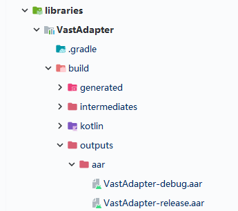

# Building

Because the new version will be released in [MavenCentral](https://search.maven.org/search?q=g:io.github.sakurajimamaii) only after the test is over, so if you want to experience the latest features, you can follow the steps below to package the jar.

Select `Android Studio Gradle` -> `libraries` -> `VastAdapter` -> `Tasks` -> `build` -> `assemble` .In this way, you can find the corresponding arr package in the path of `\build\outputs\aar`.

<figure markdown>
  { width="300" }
  <figcaption>Building</figcaption>
</figure>