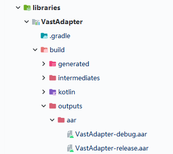

# 构建

因为新版本会在测试结束后才会在 [MavenCentral](https://search.maven.org/search?q=g:io.github.sakurajimamaii) 发布，所以如果想体验最新的特性 ，你可以按照下面的步骤打包 aar。

选择 `Android Studio Gradle` -> `libraries` -> `VastAdapter` -> `Tasks` -> `build` -> `assemble` 这样就可以在 `\build\outputs\aar` 路径下找到对应的 aar 。

<figure markdown>
  { width="300" }
  <figcaption>构建</figcaption>
</figure>